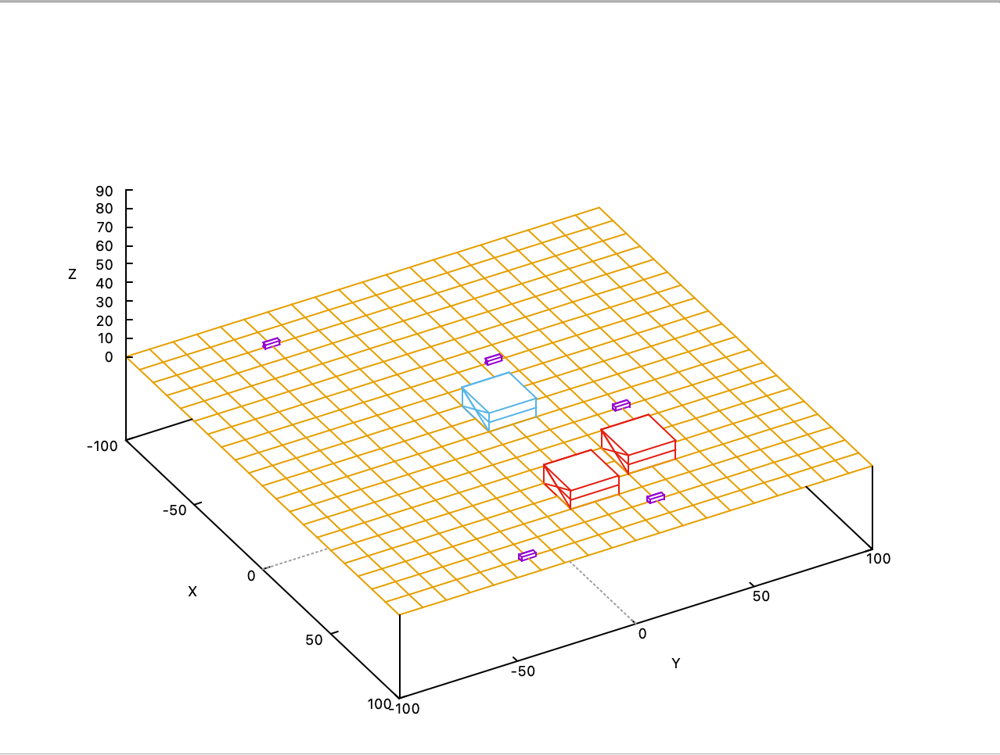

# Lazik

## Table of contents
* [General information](#general-information)
* [Technologies](#technologies)
* [Setup](#setup)
* [Additional information](#additional-information)
## General information
This project was made in Programowanie obiektowe class during 2nd semester. It is a simple simulation of the Mars rover. The user can control its movements and collect generated data samples. The rover has also a built in anti-collision system, that informs the user if a crash with another object on the map is possible. Additionally there are 3 rovers to choose from, that the user can switch between at anytime.
## Technologies
The project is created with:
* c++11
* g++
## Setup
To run this project, download its contents and follow the commands listed below:
```
$ cd prj/
$ make
```
If the project has already been compiled, in order to run it, type:
```
make start
```
## Additional information
Two of the files in this project have been made by my Professor, dr.inz. Bogdan Kreczmer. These files are: lacze_do_gnuplota.hh and lacze_do_gnuplota.cpp.

